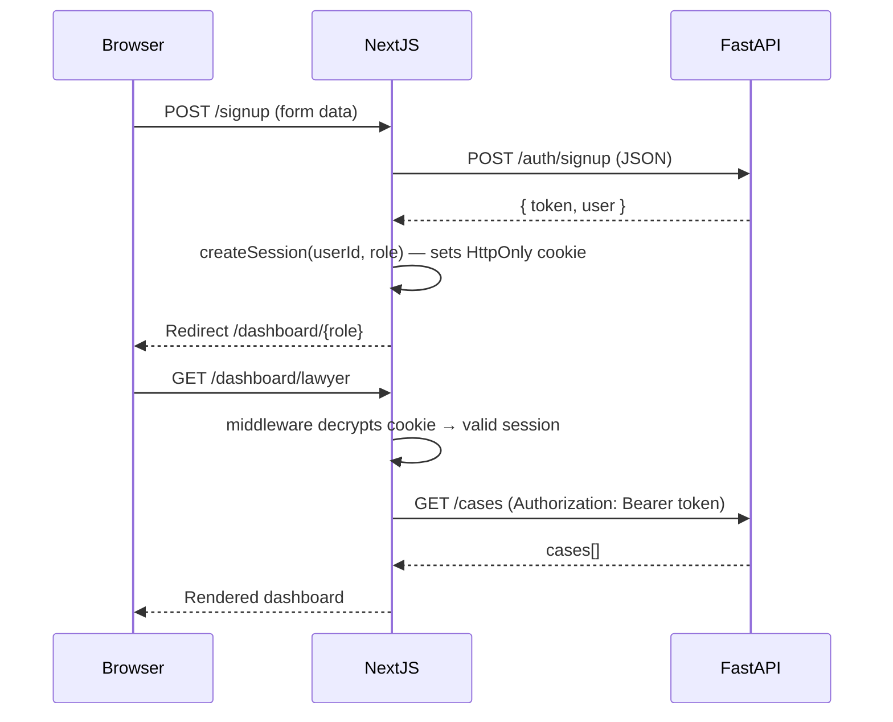
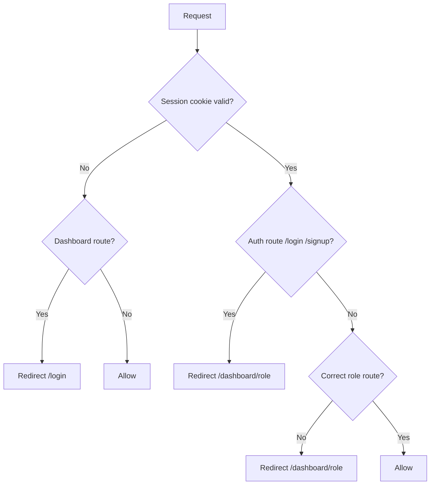

# Design Document: Law App

## Overview

A full-stack law firm application with a Next.js 16 (App Router) frontend and a FastAPI Python backend. The frontend handles public pages, auth UI, route protection, and role-based dashboards. The backend provides a REST API for authentication, cases, and tasks. Authentication uses JWT tokens issued by the API and stored in HttpOnly cookies on the frontend.

---

## Architecture

```mermaid
graph TD
  Browser -->|HTTP| NextMiddleware[Next.js Middleware]
  NextMiddleware -->|pass| PublicRoutes[Public Routes]
  NextMiddleware -->|JWT check| DashboardRoutes[Dashboard Routes]
  NextMiddleware -->|JWT check| AuthRoutes[Auth Routes /login /signup]

  subgraph Frontend [Next.js 16 Frontend]
    NextMiddleware
    ServerActions[Server Actions]
    SessionLib[lib/session.ts]
    ServerActions --> SessionLib
  end

  subgraph Backend [FastAPI Backend]
    AuthRouter[POST /auth/signup /login /logout]
    CasesRouter[GET POST PUT /cases]
    TasksRouter[GET POST /tasks]
    UserStore[(In-memory user store)]
    CaseStore[(In-memory case store)]
    TaskStore[(In-memory task store)]
    AuthRouter --> UserStore
    CasesRouter --> CaseStore
    TasksRouter --> TaskStore
  end

  ServerActions -->|HTTP fetch| Backend
  DashboardRoutes -->|HTTP fetch| Backend
```



The system has two independently runnable services:
- **Frontend** (`localhost:3000`) — Next.js 16, handles UI and session cookies
- **Backend** (`localhost:8000`) — FastAPI, handles business logic and data

---

## Components and Interfaces

### Frontend File Structure

```
app/
  (public)/
    layout.tsx            # Shared nav + footer
    page.tsx              # Home
    about/page.tsx
    terms/page.tsx
    contact/page.tsx
  (auth)/
    layout.tsx            # Minimal layout (no nav)
    login/page.tsx
    signup/page.tsx
  dashboard/
    layout.tsx            # DashboardShell (sidebar, logout)
    lawyer/page.tsx
    client/page.tsx
    employee/page.tsx
  actions/
    auth.ts               # signup, login, logout Server Actions
  lib/
    session.ts            # encrypt, decrypt, createSession, deleteSession
    api.ts                # typed fetch helpers for backend API
    definitions.ts        # Zod schemas + shared TS types
  components/
    Navbar.tsx
    Footer.tsx
    LoginForm.tsx
    SignupForm.tsx
    ContactForm.tsx
middleware.ts
```

### Backend File Structure

```
backend/
  main.py                 # FastAPI app entry point, global exception handler, logging middleware
  routers/
    auth.py               # /auth/signup, /auth/login, /auth/logout, /auth/refresh
    cases.py              # /cases CRUD
    tasks.py              # /tasks CRUD
  services/               # Business logic layer (future use)
  models/
    user.py               # User Pydantic models
    case.py               # Case Pydantic models
    task.py               # Task Pydantic models
  store/
    users.py              # In-memory user dict
    cases.py              # In-memory case dict
    tasks.py              # In-memory task dict
  auth/
    jwt.py                # create_access_token, create_refresh_token, verify_token
    deps.py               # FastAPI dependency: get_current_user
  utils/
    id.py                 # generate_id() -> UUID4 string
  requirements.txt
```

---

## Data Models

### Frontend TypeScript Types

```typescript
type Role = 'lawyer' | 'client' | 'employee'

interface User {
  id: string
  name: string
  email: string
  role: Role
}

interface SessionPayload {
  userId: string
  role: Role
  expiresAt: Date
}

type FormState =
  | {
      errors?: {
        name?: string[]
        email?: string[]
        password?: string[]
        role?: string[]
      }
      message?: string
    }
  | undefined
```

### Backend Pydantic Models

```python
# User
class UserCreate(BaseModel):
    name: str
    email: str
    password: str
    role: Literal['lawyer', 'client', 'employee']

class UserOut(BaseModel):
    id: str
    name: str
    email: str
    role: str

# Case
class CaseCreate(BaseModel):
    title: str
    status: Literal['open', 'closed', 'pending']
    lawyer_id: str
    client_id: str

class CaseOut(BaseModel):
    id: str
    title: str
    status: str
    lawyer_id: str
    client_id: str

# Task
class TaskCreate(BaseModel):
    title: str
    status: Literal['pending', 'completed']
    assigned_to: str  # employeeId

class TaskOut(BaseModel):
    id: str
    title: str
    status: str
    assigned_to: str
```

---

## API Design

### Auth Endpoints

| Method | Path | Description |
|---|---|---|
| POST | `/auth/signup` | Create user, return access + refresh tokens and user info |
| POST | `/auth/login` | Verify credentials, return access + refresh tokens and user info |
| POST | `/auth/refresh` | Exchange valid refresh token for a new access token |
| POST | `/auth/logout` | Stateless — frontend deletes cookie |
| GET | `/health` | Returns `{ "status": "ok" }`, no auth required |

Access token payload: `{ "sub": userId, "role": role, "type": "access", "exp": timestamp }` — 15-minute expiry
Refresh token payload: `{ "sub": userId, "type": "refresh", "exp": timestamp }` — 7-day expiry

Rate limiting (via `slowapi`): max 10 requests/minute per IP on `/auth/signup`, `/auth/login`, `/auth/refresh`.

### Cases Endpoints

| Method | Path | Auth | Description |
|---|---|---|---|
| GET | `/cases` | Required | Returns cases filtered by role (lawyer sees assigned, client sees own) |
| POST | `/cases` | Lawyer only | Create a new case |
| PUT | `/cases/{id}` | Lawyer only | Update case status |

### Tasks Endpoints

| Method | Path | Auth | Description |
|---|---|---|---|
| GET | `/tasks` | Employee only | Returns tasks assigned to the authenticated employee |
| POST | `/tasks` | Employee only | Create a new task |

---

## Authentication Flow



---

## Session Management (Frontend)

The frontend maintains its own session cookie (JWT signed with `SESSION_SECRET` loaded from env) for middleware route protection. The raw API access token is also stored in the session payload so Server Actions can forward it to the backend.

- `encrypt(payload)` — signs a JWT with HS256, 7-day expiry (using `jose`)
- `decrypt(token)` — verifies and decodes the JWT
- `createSession(userId, role, apiToken)` — encrypts payload, sets HttpOnly cookie
- `deleteSession()` — deletes the session cookie

`api.ts` fetch helpers automatically redirect to `/login` on a 401 response (access token expired).

---

## Route Protection (Middleware)

`middleware.ts` runs on every request matching `/dashboard/:path*`, `/login`, `/signup`.



---

## Validation

### Frontend (Zod in `lib/definitions.ts`)

- `SignupFormSchema` — name (min 2), email, password (min 8, letter + number + special char), role (enum)
- `LoginFormSchema` — email (non-empty), password (non-empty)
- `ContactFormSchema` — name (min 2), email, message (min 10)

### Backend (FastAPI + Pydantic)

- Pydantic models enforce field types and constraints on all request bodies
- `HTTPException(400)` for validation failures
- `HTTPException(401)` for missing/invalid JWT
- `HTTPException(403)` for insufficient role permissions
- `HTTPException(409)` for duplicate email on signup

---

## Correctness Properties

A property is a characteristic or behavior that should hold true across all valid executions of a system — essentially, a formal statement about what the system should do. Properties serve as the bridge between human-readable specifications and machine-verifiable correctness guarantees.

### Property 1: Session round-trip

*For any* valid `SessionPayload`, encrypting it and then decrypting the result should produce an equivalent payload (same `userId`, `role`, and `expiresAt`).

**Validates: Requirements 4.2, 5.1**

---

### Property 2: Signup validation rejects invalid inputs

*For any* signup form submission where at least one field is invalid (email malformed, password shorter than 8 characters, name shorter than 2 characters, or role missing), the `signup` Server Action should return a non-empty `errors` object and not call the API.

**Validates: Requirements 3.4, 3.5, 3.6**

---

### Property 3: Login validation rejects empty fields

*For any* login form submission where email or password is an empty string, the `login` Server Action should return a non-empty `errors` object and not call the API.

**Validates: Requirements 4.4**

---

### Property 4: Contact form validation rejects incomplete submissions

*For any* contact form submission where name, email, or message is missing or empty, the contact Server Action should return a non-empty `errors` object.

**Validates: Requirements 1.6**

---

### Property 5: Role-based redirect invariant

*For any* authenticated User with role R, navigating to `/dashboard/{R2}` where R2 ≠ R should always result in a redirect to `/dashboard/{R}`, never rendering the wrong dashboard.

**Validates: Requirements 5.2**

---

### Property 6: API role enforcement — cases

*For any* authenticated request to `POST /cases` or `PUT /cases/{id}` made by a User whose role is not `lawyer`, the API should return a 403 response.

**Validates: Requirements 6.5**

---

### Property 7: API role enforcement — tasks

*For any* authenticated request to `GET /tasks` or `POST /tasks` made by a User whose role is not `employee`, the API should return a 403 response.

**Validates: Requirements 7.4**

---

## Error Handling

### Frontend
- Form validation errors: returned as structured `errors` objects from Server Actions, displayed inline.
- API 409 on signup: display "Email already in use."
- API 401 on login: display generic "Invalid email or password."
- Session decryption failure: middleware redirects to `/login`.
- Unexpected errors: display "Something went wrong. Please try again."

### Backend
- 400: Pydantic validation failure
- 401: Missing or invalid JWT
- 403: Insufficient role
- 404: Resource not found
- 409: Duplicate email on signup
- 429: Rate limit exceeded on auth endpoints
- 500: Unhandled exception — global handler in `main.py` returns `{ "detail": "Internal server error" }` without leaking stack traces; full error logged to stdout

All requests, errors, and auth events are logged to stdout via Python's `logging` module at INFO/ERROR level.

---

## Testing Strategy

### Dual Testing Approach

Both unit tests and property-based tests are used:
- Unit tests verify specific examples, edge cases, and integration points.
- Property-based tests verify universal properties across many generated inputs.

### Frontend Testing

- Framework: Jest + `ts-jest`
- Property-based: `fast-check` (min 100 iterations per property)
- Tag format: `// Feature: law-app, Property {N}: {property_text}`

| Property | Test |
|---|---|
| P1: Session round-trip | Generate `SessionPayload` → encrypt → decrypt → deep equal |
| P2: Signup rejects invalid | Generate invalid inputs → Zod parse → assert errors non-empty |
| P3: Login rejects empty | Generate empty fields → Zod parse → assert errors non-empty |
| P4: Contact rejects incomplete | Generate incomplete inputs → Zod parse → assert errors non-empty |
| P5: Role redirect invariant | Generate role pairs → mock middleware → assert redirect target |

### Backend Testing

- Framework: `pytest`
- Property-based: `hypothesis` (min 100 examples per property)

| Property | Test |
|---|---|
| P6: Cases role enforcement | Generate non-lawyer users → POST/PUT /cases → assert 403 |
| P7: Tasks role enforcement | Generate non-employee users → GET/POST /tasks → assert 403 |
